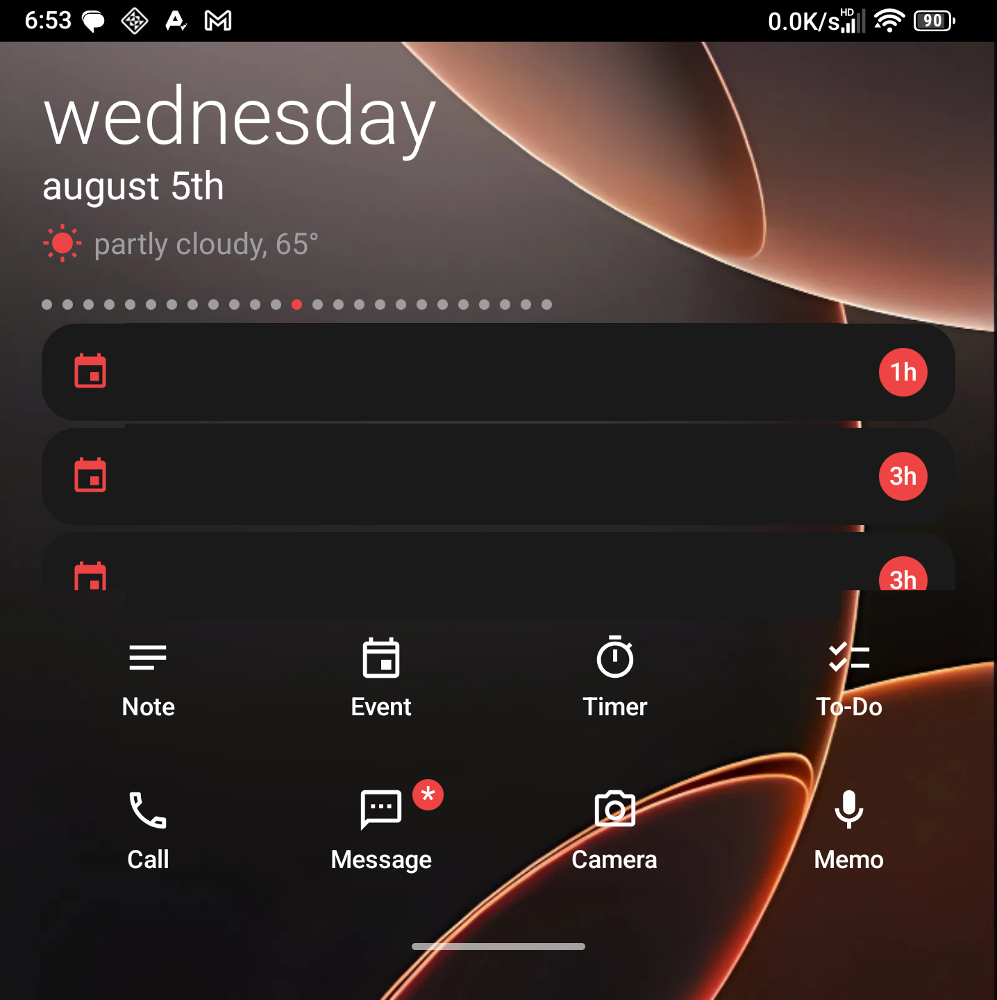
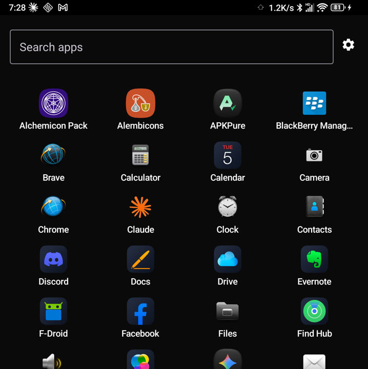
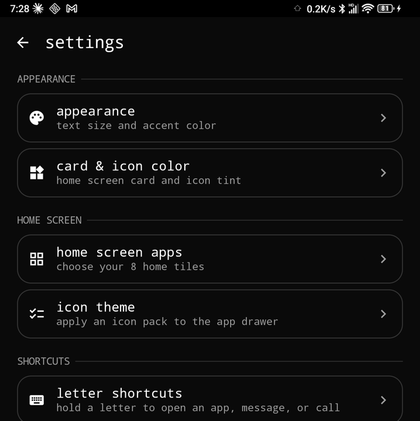
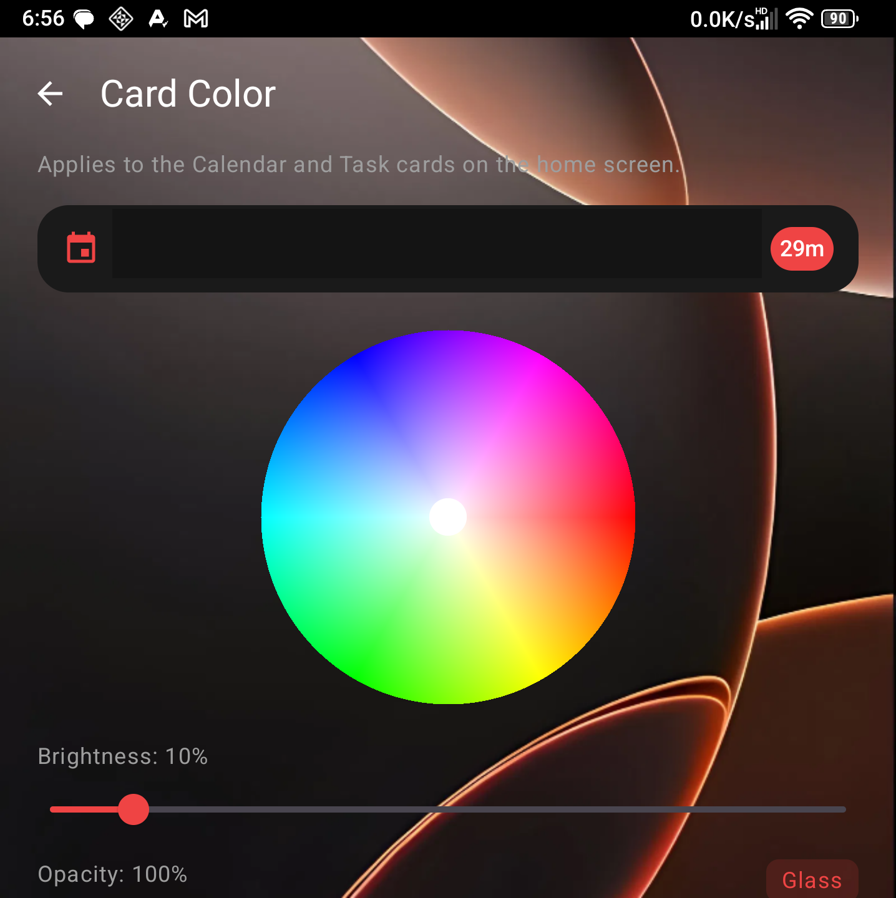

# Vibe Launcher

A custom Android home-screen launcher, built with Kotlin and Jetpack Compose. Vibe Launcher replaces the stock home screen with a fixed, distraction-light layout: today's date and weather up top, your calendar and tasks for the day, and 8 fully customizable quick-launch tiles - all sitting directly on your wallpaper.

This is a first prototype, built for and tested on a physical device (Unihertz Titan 2).

## Screenshots

| Home | App Drawer |
|---|---|
|  |  |

| Launcher Settings | Card Color picker |
|---|---|
|  |  |

## Features

- **Fixed header** - day of week, date, and weather (by zip code), pinned in place and never scrolling.
- **Calendar & Tasks** - today's next event and task shown collapsed; tap to expand in place into a scrollable list of everything else that day, starting from whichever event you're currently on.
- **8 customizable tiles** - reassign any of the 8 home-screen slots to any installed app, either by long-pressing the tile directly or from a dedicated "Home Screen Apps" screen in settings.
- **Notification badges** - a small red badge appears on any tile whose app has an active notification (unread texts, missed calls, etc.), via Android's notification listener API.
- **App drawer** - swipe up (or tap the drag handle) to open a full searchable list of installed apps, with a slide-up/slide-down animation and swipe-down-to-dismiss.
- **Icon theming** - apply any installed icon pack to the app drawer, with an option to also apply it to the home-screen tiles.
- **Card Color** - a full HSV color wheel plus brightness and opacity sliders to customize the Calendar/Task card color, including a "Glass" mode that turns the cards transparent so the wallpaper shows through clearly.
- **Real wallpaper support** - the home screen renders directly over your system wallpaper rather than a solid background.

## Tech stack

- Kotlin, Jetpack Compose, Navigation Compose
- MVVM with `ViewModel` + `StateFlow`
- Jetpack DataStore (Preferences) for settings persistence
- `CalendarContract` for calendar/task data, `LauncherApps` for app enumeration, `NotificationListenerService` for notification badges

## Building

```bash
./gradlew assembleDebug
```

The debug APK will be at `app/build/outputs/apk/debug/app-debug.apk`. Install it with:

```bash
adb install -r app/build/outputs/apk/debug/app-debug.apk
```

Then set it as your default home app:

```bash
adb shell cmd role add-role-holder android.app.role.HOME com.vibelauncher.app
```

## Status

Early prototype - built iteratively through hands-on testing on a real device. Expect rough edges. Contributions and feedback welcome.
