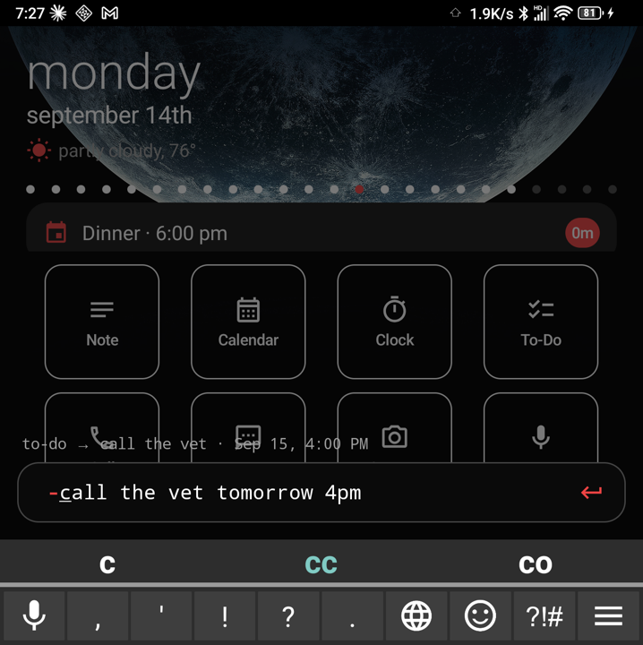
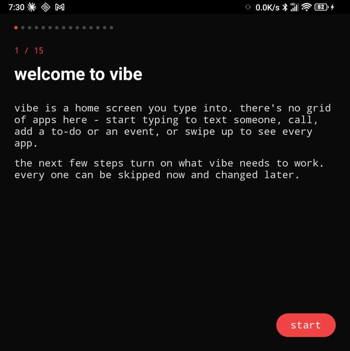
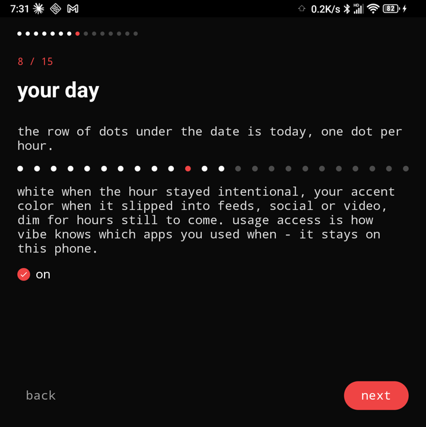
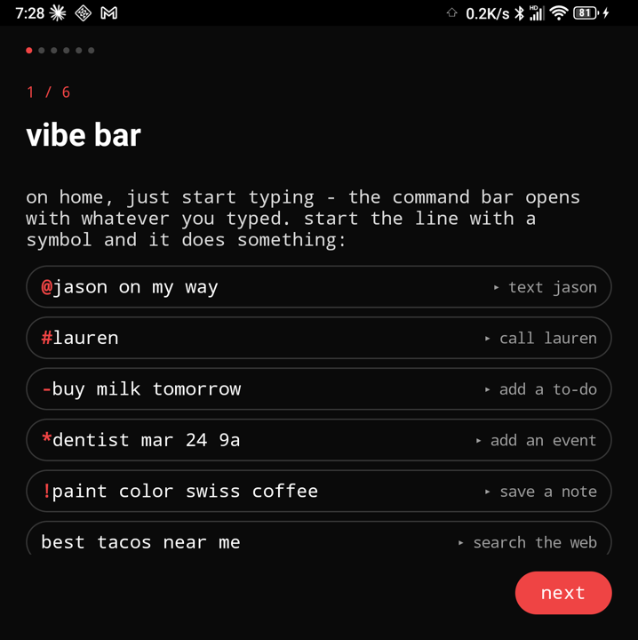
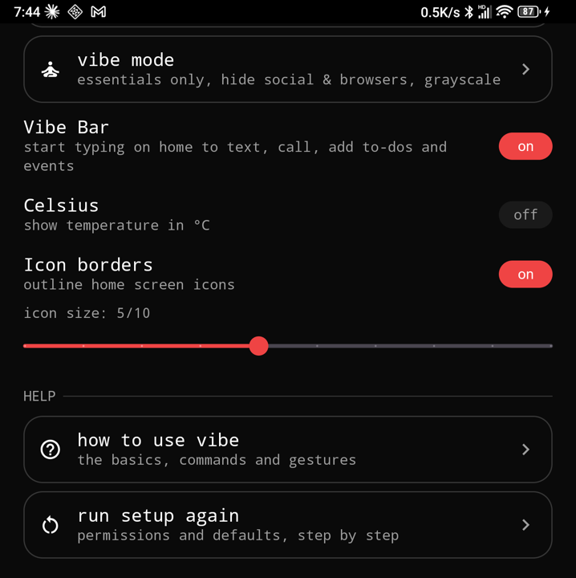
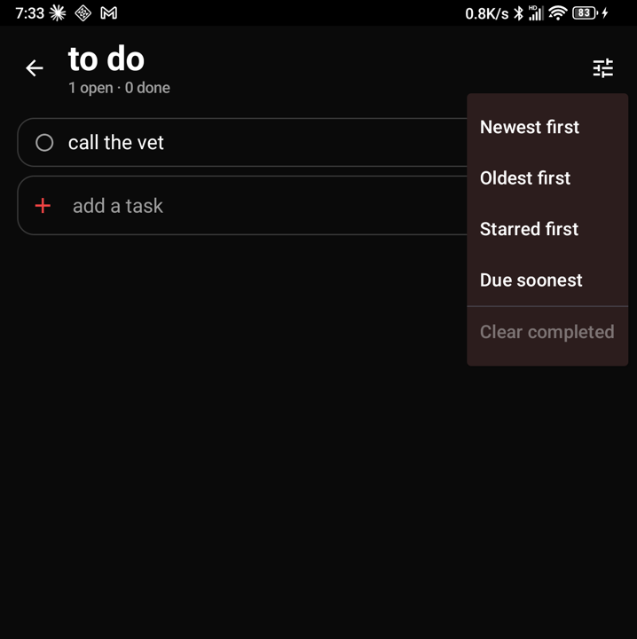
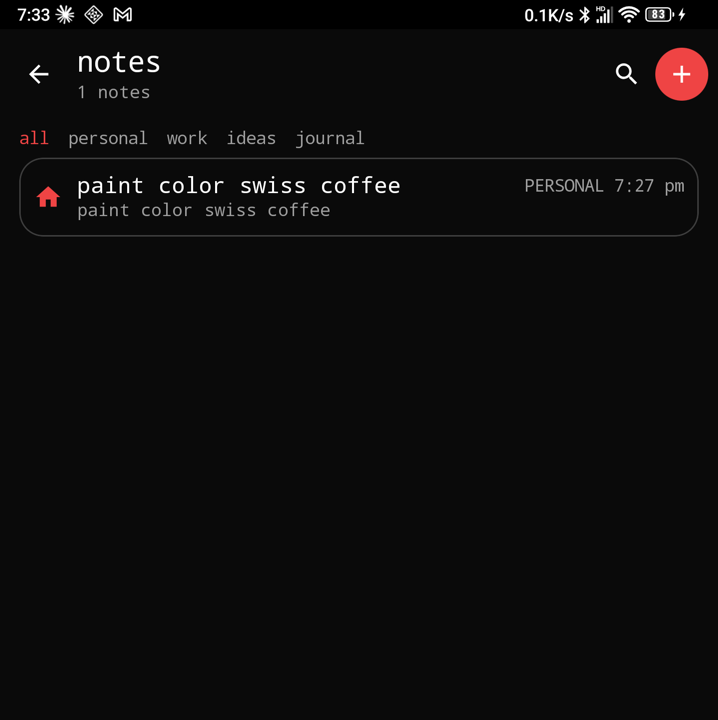

# Vibe Launcher

A keyboard-first Android home screen, built with Kotlin and Jetpack Compose. Vibe Launcher replaces the stock home screen with a calm, fixed layout sitting right on your wallpaper:
- today's date and weather, with a dot for every hour of your day;
- your calendar and to-dos;
- 8 quick-launch tiles.

Start typing on a hardware keyboard and the Vibe Bar slides up: text someone, call someone, add a to-do, an event or a note, all in one line without leaving home.

Built for and tested on a physical device (Unihertz Titan 2), but it works on any Android phone.

## Screenshots

| Home | Vibe Bar |
|---|---|
|  |  |

| First-run setup | Setup: your day |
|---|---|
|  |  |

| Feature tour | App drawer |
|---|---|
|  |  |

| Settings | Settings: toggles & help |
|---|---|
|  |  |

| To-Do | Notes |
|---|---|
|  |  |

## Getting started

1. Download the latest `vibelauncher-X.Y.Z.apk` from [Releases](https://github.com/cfranyota/vibe-launcher/releases) and open it on your phone. Installing from outside the Play Store needs to be allowed.
2. Open Vibe Launcher. On first launch a setup screen walks you through everything, one step at a time. Each step explains what it unlocks, and any step can be skipped:
   - making Vibe your home screen;
   - on Titan phones, switching off the phone's own letter-key shortcuts;
   - calendar, contacts, texting & calling, notification access, usage access, and your weather location.
3. A short tour follows: Vibe Bar's symbols, a try-it step, getting around home, and where settings live.

You can come back to either any time from **Settings → Help** ("how to use vibe", "run setup again"). To reach Settings, swipe up for the app drawer and tap the gear.

## Features

### Home screen
- **Date & weather**: day, date and current weather by US zip or Canadian postal code, in °F or °C. Swipe left or right to look at other days.
- **Activity dots**: one dot per hour of the day.
  - White means that hour stayed intentional.
  - Your accent color means more than half its screen time went to feeds, social apps or media.
  - Dim means the hour hasn't happened yet.
  - This uses Usage Access, and all of it stays on the phone.
- **Calendar card**: leads with your current or next event. Tap it to expand the whole day.
- **To-Do card**: leads with whatever is due next, with a due badge (`45m`, `today`, `tmr`, `late`).
- **8 tiles**: any installed app or one of Vibe's own actions (To-Do, Notes, Calendar, AI, Camera and more). The **AI** tile opens whichever assistant app is your phone's default (Gemini, ChatGPT, Claude…). Long-press a tile to swap it. Tiles show a badge when their app has a notification.
- **Icon borders**: an optional outline around each tile.
  - Steps 1–5 grow a square up to the biggest size that fits.
  - Steps 6–10 widen the tiles without making them taller, until neighbors touch at 10.
- **Icon size**: defaults to 2/10 with stock icons and 5/10 once an icon theme is applied.

### Vibe Bar
Start typing on a hardware keyboard and the bar slides up from the bottom. On touch-only phones, double-tap. The first character picks the action, a preview line shows what will happen, and **Enter** runs it.

| Type | Does |
|---|---|
| `@name message` | Texts a contact directly |
| `#name` | Calls a contact |
| `-ring vet tomorrow 4pm` | Adds a to-do, due tomorrow at 4pm |
| `*dentist mar 24 9a` | Writes an event straight to your calendar |
| `!paint color swiss coffee` | Saves a note to Notes |
| anything else | Web search |

Dates understand:
- `today`, `tonight`, `tomorrow`/`tmr`;
- weekdays (`friday`, `next friday`), `mar 24`, `3/24`;
- times like `9a`, `4:30pm`, `16:00`;
- relative times like `in 30 min`, `in 2 hours`, `in 3 days`, `in 2 weeks`.

Leave the time off for an all-day event.

### To-Do
- Open and done items in one list. Tap to check an item off; long-press to edit, star, delete, or clear its due date.
- Due dates come from plain text (`call mom friday`) and turn your accent color when overdue.
- Sort by newest, oldest, starred, or **due soonest**.
- **Clear completed** removes every finished to-do at once, with Undo.

### Notes
- A full notes app with categories, checklists and bold/italic/underline.
- `!` in Vibe Bar saves straight into it.

### Shortcuts
- **Letter shortcuts**: hold a letter on the home screen to open an app, message someone, or call them.
- **Vibe Mode**: an essentials-only app drawer that hides social apps and browsers, with optional grayscale.

### App drawer & appearance
- **App drawer**: swipe up for a searchable list of every app. The gear beside the search box opens Settings.
- **Icon themes**: apply any installed icon pack to the drawer and, optionally, the home tiles.
- **Accent color & text size**: an app-wide accent color and a font size slider.
- **Card & icon color**: HSV wheels for the home cards (including a see-through "Glass" mode) and the home screen icons.

## Tech stack

- Kotlin, Jetpack Compose, Navigation Compose
- MVVM with `ViewModel` + `StateFlow`
- Jetpack DataStore (Preferences) for settings, to-dos and notes
- Android APIs:
  - `CalendarContract` for reading and writing events
  - `LauncherApps` for listing apps
  - `NotificationListenerService` for badges
  - `UsageStatsManager` for the activity dots
  - `RoleManager` for becoming the home app

## Building

```bash
./gradlew assembleDebug
```

The debug APK will be at `app/build/outputs/apk/debug/app-debug.apk`. Install it with:

```bash
adb install -r app/build/outputs/apk/debug/app-debug.apk
```

First-run setup offers to make Vibe your home app. To do it from the command line instead:

```bash
adb shell cmd role add-role-holder android.app.role.HOME com.vibelauncher.app
```

## Status

A personal project, built iteratively through hands-on testing on a real device. Expect rough edges. Contributions and feedback welcome.

## Changelog

- **1.0.16**: First-run setup and feature tour, due dates on to-dos, smarter dates, new icon size defaults.
  - **Setup.** A fresh install walks through making Vibe the home screen, Titan letter-key shortcuts, and calendar, contacts, texting & calling, notification access, usage access and weather location. Every step is skippable.
  - **Tour.** A tour follows setup, including a try-it step that saves a real to-do.
  - **Settings access.** A gear in the app drawer opens Settings. Settings → Help can replay the tour or run setup again.
  - **Smarter dates.** Vibe Bar now understands `in 2 hours`, `in 30 min`, `in 3 days 9a`, `in 2 weeks`, `tonight` and `tmr`.
  - **Due dates on to-dos.** `-ring vet tomorrow 4pm` saves a to-do due tomorrow at 4pm. Overdue items turn your accent color, there's a "Due soonest" sort, and the home card leads with what's due next.
  - **Clear completed** removes every finished to-do at once, with Undo.
  - **Celsius** weather switch.
  - **Icon borders.** 5/10 is now the biggest square tile. 6–10 widen tiles until neighbors touch.
  - **Icon size** defaults to 2/10 with stock icons and 5/10 with an icon theme.
- **1.0.15**: Vibe Bar becomes one line, one action.
  - Commands are now `@` text, `#` call, `-` to-do, `*` calendar event and `!` note. Each finishes without leaving home.
  - `*` parses dates and writes the event silently. `!` saves straight to Notes.
  - Hardware Enter runs the command.
  - The `?` prefix was removed.
  - New activity dots replace the day dots: one per hour, showing intentional or distracted time.
  - Home tiles no longer shrink while the keyboard is open.
- **1.0.14**:
  - A full Notes app (checklists, categories, rich text) replaces the scratch pad.
  - To-Do redesign: one list, tap to toggle, long-press for edit/delete/star, sorting.
  - Letter Shortcuts.
  - Vibe Mode (formerly Monk Mode).
- **1.0.12**: Vibe Bar and Settings redesign.
  - Vibe Bar: outlined input, colored prefixes, a preview line, "saved/sent" confirmations, contact suggestions.
  - Settings: reorganized sections, app-wide accent color, font size slider, pill toggles.
  - Home tiles: "Timer" became "Clock" and "Event" became "Calendar". New Icon Size slider, and a "Don't change homescreen apps" toggle.
  - The calendar card leads with the next timed event.
  - Home Screen Apps became a single checklist that includes built-in actions.
  - Canadian postal codes for weather.
  - Double-tap opens Vibe Bar on touch-only phones.
- **1.0.11**: Separated the home screen's calendar and to-do cards, gave to-dos their own icon, and added an icon color wheel to Settings:
  - **Top card is now calendar-only, bottom card is now to-do-only.** Previously the bottom "Tasks" card mixed real calendar all-day events (e.g. "Cox due $52") together with local to-dos added via Vibe Bar's `-`, which made it unclear which was which. All-day events now render in the top card, listed first (ahead of the day's timed events); the bottom card shows only local to-dos, and doesn't appear at all unless at least one exists (`HomeViewModel.kt`, `HomeScreen.kt`).
  - **To-do card gets its own icon** - `EventCard`/`ExpandableEventSection` now take an `icon` parameter; the to-do card uses the same checklist glyph as Vibe Bar's `-` action instead of a calendar icon.
  - **New "Icon Color" wheel** in Settings ("Card Color" renamed to "Card & Icon Color") - a second HSV wheel + brightness slider, independent of and off by default like the existing card-background color, that recolors the calendar icon, the to-do icon, the "5m"/"0m"/"•" badge circle, and the weather sun icon together (`SettingsRepository.kt`, `CardColorScreen.kt`, `DateWeatherHeader.kt`).
- **1.0.10**: Reworked `/` from a saved note into an ephemeral scratchpad, and fixed the software keyboard hiding its buttons:
  - **`/` no longer saves anything.** Removed the persisted Notes feature entirely (`NotesRepository`, the Notes list screen, `NoteItem` - all deleted). Typing `/` in Vibe Bar (or tapping the home screen's "Note" tile) now opens `NoteBubble`, a half-page sheet with no repository behind it at all - the draft lives only in memory and is gone the moment the sheet closes.
  - Multi-line text field where Enter inserts a newline (never submits). A trash icon confirms before clearing ("This draft will permanently be cleared" / Cancel / Delete). Copy puts the text on the clipboard; Share opens Android's native share sheet (`Intent.ACTION_SEND` + chooser) with the recent-contacts row and the full app list (Messages, Gmail, Quick Share, Chrome, etc.) - both stay available after use so the same note can go to more than one place.
  - Vibe Bar now hands off to `NoteBubble` immediately on `/` rather than rendering its own note editor - collapses cleanly with no visible flash.
  - Fixed the software keyboard covering `NoteBubble`'s Copy/Share buttons - added `android:windowSoftInputMode="adjustResize"` so the window (and the sheet) resizes above the keyboard instead of being covered by it.
- **1.0.9**: Vibe Bar polish pass, all in `VibeBar.kt`/`VibeBarComponents.kt` unless noted:
  - **Always-visible shortcuts legend** - the `HOT KEYS` reference grid (`@` Text, `#` Call, `-` To-Do, `/` Note, `+` Event, `?` App) now shows above the input every time Vibe Bar is open, not just in an empty state that could no longer actually occur once 1.0.8 made the bar hidden-until-typed (typing always arrives with a character already in it). Hidden only in `/` note mode, where the full-screen editor needs the space and the prefix is already fixed. Tap any entry to switch commands, same as before.
  - **Reworked the six per-action accent colors** (`ui/theme/Color.kt`) - `@`/`#`/`-`/`/`/`+`/`?` each still get their own color (used consistently across the legend, the input's send button, the contact chip, and result rows), but the six were previously stock Tailwind/Bootstrap hex values used as-is; retuned into a deliberately-spaced set (teal/green/amber/plum/terracotta/slate) so `-` To-Do and `+` Event - previously two adjacent ambers/browns - now read apart at a glance, and `?` App no longer shares a hue with the app's own red accent.
  - **Background is near-black, not pure black** (`LauncherBlack` in `Color.kt`, `#0A0A0A` instead of `#000000`) - affects Vibe Bar's dimming scrim behind the expanded bar, plus the Settings/Notes/To-Do screen backgrounds that share the same theme token.
  - **Deleting a note or to-do is reversible** - the Notes and To-Do screens (opened from Vibe Bar's `/` and `-`, or the home screen's Note/To-Do tiles) now show a "deleted" snackbar with an Undo action instead of deleting silently and permanently; Undo restores the exact item.
  - Tightened several off-grid paddings in the bar and its legend onto a consistent 8dp spacing rhythm.
- **1.0.8**: Vibe Bar is now hidden until you start typing on a hardware keyboard, then slides up from the bottom (was a tap-to-expand pill before). `@`/`#` now send the text/place the call directly instead of opening another app (adds `SEND_SMS`/`CALL_PHONE` permissions). `-`/`/` now save into new local To-Do and Notes stores instead of handing off to the Calendar app / a share sheet - reachable from the existing home-screen "To-Do"/"Note" tiles, with edit and delete. To-dos also show in the Tasks bar.
- **1.0.7**: Added Vibe Bar, a floating command input (on by default) above the tile grid: `@`/`#` text or call a contact, `-`/`+` add a to-do/event, `/` shares a note, `?` searches installed apps, plain text runs a web search. Adds a Contacts read permission, used only for the `@`/`#` search.
- **1.0.6**: Icon border tiles are now square (not wider-than-tall) and scale to fill the full column width, matching the reference design more closely.
- **1.0.5**: Added an "Icon borders" toggle in Launcher Settings that draws a thin white outline around each home-screen tile. Off by default.
- **1.0.4**: Added an on/off toggle for Card Color. Off by default - cards stay the fixed default color until explicitly enabled.
- **1.0.3**: Fixed notification badge size and positioning.
- **1.0.2**: Replaced the notification badge with a glossy 3D sphere icon.
- **1.0.1**: Switched to an improved sphere image for the notification badge.
- **1.0**: Initial release.
